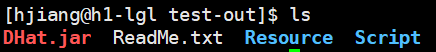
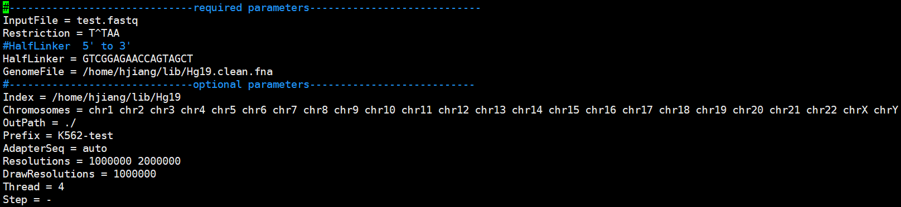
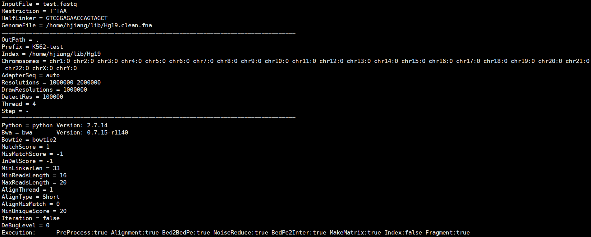

## Introduction

**DHat** is an efficient and using easily tool, it intergrate **[linker filtering]()**, **[alignment]()**, **[noise reduce]()** and **[matrix building]()**.


**[install](#Install)**   
**[usage](#Usage)**
## Install

Before you use **DHat** you would better install some dependent tools.
Please ensure your server can connect to network.  
Install **[Anaconda (Python 2.7 version)](https://www.anaconda.com/distribution/)**
```
$ wget https://repo.anaconda.com/archive/Anaconda2-2018.12-Linux-x86_64.sh
$ bash ./Anaconda2-2018.12-Linux-x86_64.sh -p ~/
```
Install **[mafft](https://mafft.cbrc.jp/alignment/software/)** and **[bwa](http://bio-bwa.sourceforge.net/)**
```
$ conda install -c bioconda mafft
$ conda install -c bioconda bwa
```
Install Python moudle
```
$ pip install matplotlib
$ pip install scipy
```
Download and install **[JRE](https://www.oracle.com/technetwork/java/javase/downloads/server-jre8-downloads-2133154.html)** (necessary)  
**I am not sure the `wget` command can work well, you would better download JRE from webpage and then upload to server**
```
$ wget https://download.oracle.com/otn-pub/java/jdk/8u201-b09/42970487e3af4f5aa5bca3f542482c60/jre-8u201-linux-x64.tar.gz
$ tar -zxf server-jre-8u201-linux-x64.tar.gz
$ export PATH=jre1.8.0_201/bin/:$PATH
```
**If you don't want to execute the last command after you connect server each time, you can append this command to your file named ".barsh_profile" or use the following command**
```
$ echo 'export PATH=jre1.8.0_201/bin/:$PATH' >> ~/.bash_profile
```
By now, we have installed all dependence, then you can download DHat.jar from this page.
Then, install **DHat**
```
$ java -jar DHat.jar install
```
## Usage

**Usage**: java -jar DHat.jar [options], you can get the all information of command options by `java -jar DHat`
```
-i          <file>     Input file (FASTQ format)
-o,--out    <dir>      Output directory (must be exist)
-p          <string>   Output prefix
-conf       <file>     Configure file
-adv        <file>     Advanced configure file
-r,--res    <ints>     Resolutions (separated by spaces)
-s,--step   <strings>  Section you want to running (separated by spaces)
-t,--thread <int>      Number of threads
-D,--Debug  <int>      Debug Level (default 0)
-pbs                   running by pbs
```
**DHat** support many options, the most general usage of **DHat** is:
```
$ java -jar DHat.jar -conf <configure file>
```

1. Set the configure file

    After install **DHat**, there are two new directory: ***Script*** and ***Resource***. The ***Script*** folder include some python script, ***Resource*** folder include a template of configure file.

    

    download a test data
    copy template configure file
    ```
    $ cp Resource/default.conf ./test.conf
    ```
    edit *test.conf* and set value like following figure
    ```
    $ vi test.conf
    ```
    
    
    *Note:* The *OutPath* you set must be existed.  
    *Note:* If you don't know the **HalfLinker** or **Restriction**, you can set these parameters *blank*. The detail see [Linker detection](#Linker detection).
1. Save your set and execute **DHat**

    ```
    $ java -jar DHat.jar -conf test.conf > log.txt 2> err.txt
    ```
    Program will print the configure information shortly
    

---

\#-------------------------ConfigFile: Such as follow----------------------------  
```
#------------------------------required parameters----------------------------  
InputFile = DLO-test.fastq  
Restriction = T^TAA  
HalfLinker = GTCGGAGAACCAGTAGCT  
GenomeFile = Hg19.clean.fna  
#------------------------------optional parameters---------------------------  
OutPath = ./  
Prefix = out  
Index = Hg19  
Chromosomes =  
EnzymeFragmentPath =
AdapterSeq =  
Resolutions = 1000000  
DrawResolutions = 1000000  
Thread = 4  
Step = -  
#------------------------------advance parameters---------------------------  
MatchScore = 1  
MisMatchScore = -1  
InDelScore = -1  
MinLinkerLen =  
MinReadsLength = 16  
MaxReadsLength = 20  
AlignThread = 1  
AlignType = Short  
AlignMisMatch = 0  
MinUniqueScore =  
Iteration = true  
DeBugLevel = 0  
```
explain
```
InputFile           String      Input File with Fastq Format
Restriction         String      Sequence of restriction, enzyme cutting site expressed by "^"
HalfLinker          String[]    Halflinker sequences (different half-linker separated with a space)
GenomeFile          String      Reference genome file
#===============================================================================
OutPath             String      Path of output  (default    "./")
Prefix              String      prefix of output    (default    "DLO_Out")
Index               String      Index prefix of reference genome
Chromosomes         String[]    Chromosome name must same as Chromosome name in reference genome    (default all in reference genome)
AdapterSeq          String[]    Adapter sequence, null means don't remove adapter   (default    "")
                                If you want to remove adapter but you don't know the adapter seq, you can set "Auto"
EnzymeFragmentPath  Path        Enzyme fragment path, created by this tool. If you set it, program will not create  Enzyme fragment file.
Resolutions         Int[]       Bin size when create interaction matrix  (default    "1000000" byte)
DrawResolution      Int[]       Resolution for you draw heat-map    (default    "100000")
Thread              Int         Number of threads    (default    "4")
Step                String[]    assign  where start and end (default    "-")
#===============================================================================
MatchScore          Int         Match score in linker filter    (default    "1")
MisMatchScore       Int         MisMatch Score in linker filter (default    "-1")
InDelScore          Int         Indel Score in linker filter    (default    "-1")
MinLinkerLen        Int         Minimum linker length
MinReadsLength      Int         Min reads length when extract interaction reads (default    "16")
MaxReadsLength      Int         Max reads length when extract interaction reads (default    "20")
AlignThread         Int         Threads in alignment (default    "2")
AlignType           String      Reads type include ["Short","Long"] (default    "Short")
AlignMisMatch       Int         MisMatch number in alignment    (default    "0")
MinUniqueScore      Int         Minimum mapQ what reads mapQ less than it will be removed
Iteration           Bool        "true" or "false" represent whether do iteration alignment
DeBugLevel          Int         0 means remain base output, 1 means more output, 2 means all output (default    "0")
```

*Note*: If we set **ReadsType** "Short", we will align with `bwa aln`,and if set "Long",we will align with `bwa mem`.  
*Note*: **Step** include "PreProcess" "Alignment" "Bed2BedPe" "NoiseReduce" "BedPe2Inter" "CreateMatrix"  
*Note*: If we want to run from "Alignment" to "CreateMatrix", we can set "Alignment - CreateMatrix"  
*Note*: If we only want to run from "Alignment" to end, we can set "Alignment -"  
*Note*: If we want to run all, we can set "-"

##Other Script
```
java -cp DHat.jar Utils.BedToBedpe
java -cp DHat.jar Utils.CalculateLineNumber
java -cp DHat.jar Utils.CreateMatrix
java -cp DHat.jar Utils.FastqExtract
java -cp DHat.jar Utils.PetCluster
java -cp DHat.jar Utils.RangeCount
java -cp DHat.jar Utils.SamFilter
java -cp DHat.jar Component.tool.Annotation
java -cp DHat.jar Component.tool.LinkerDetection
java -cp DHat.jar Bin.Guide    (need visual interface)
```

##Linker detection
If you don't know the value of parameter **Restriction** or **HalfLinker**, you can try to use the follow methods.  
1. use `java -cp DHat.jar Component.tool.LinkerDetection`  
    **argument**  
    ```
    -i      input file (fastq or fastq.gz format)
    -e      restriction sequence such as A^AGCTT (default 'autiomatic detection', 
            if you don't want to detect restriction sequence, please set 'no')
    -f      threshold (default 0.05, highter value means less data remain)
    -k      k-mer length (default 10)
    -n      sequence number use to processing (default 5000)
    ```
    **result**  
    The first line is restriction sequence, following is linker sequence
    ```
    C^CGG
    CGTCGGATTAGGTGTATCTAGATACACCTAATCCGACG	+	760.0
    CGTCGGAGAACCAGTAGCTAGCTACTGGTTCTCCGACG	+	800.0
    ```
2. set **"Restriction"** or **"HalfLinker"** blank.  
    for example 
    ```
    #------------------------------required parameters----------------------------  
    InputFile = DLO-test.fastq  
    Restriction = 
    HalfLinker = 
    GenomeFile = Hg19.clean.fna  
    ```